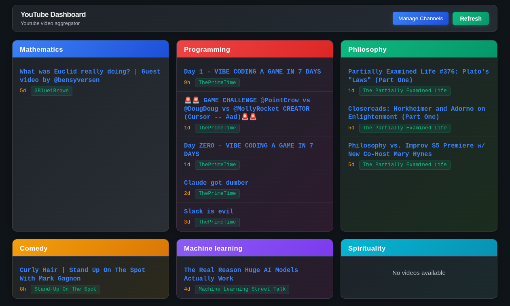

# 🎥 YouTube Video Dashboard

A modern, colorful web application that aggregates and displays the latest videos from your favorite YouTube channels, organized by custom categories.



## ✨ Features

- **🎨 Beautiful Modern UI**: Clean, colorful interface with gradient backgrounds and smooth animations
- **📂 Category Organization**: Organize channels into custom categories with unique color schemes
- **⚡ Real-time Updates**: Fetch the latest videos from YouTube channels automatically
- **🔧 Easy Management**: Add/remove channels and categories through an intuitive web interface
- **⏰ Time Filtering**: Configure how far back to fetch videos (days/months)
- **📱 Responsive Design**: Works perfectly on desktop and mobile devices
- **🚀 Fast Performance**: Built with FastAPI for high performance and low latency

## 🛠️ Technology Stack

- **Backend**: Python 3.8+ with FastAPI
- **Frontend**: Vanilla HTML, CSS, JavaScript
- **API**: YouTube Data API v3
- **Styling**: Modern CSS with gradients and animations
- **Server**: Uvicorn ASGI server

## 📋 Prerequisites

- Python 3.8 or higher
- YouTube Data API key ([Get one here](https://developers.google.com/youtube/v3/getting-started))

## 🚀 Installation

1. **Clone the repository**
   ```bash
   git clone <your-repo-url>
   cd yt-urls
   ```

2. **Install dependencies**
   ```bash
   pip install -r requirements.txt
   ```

3. **Set up environment variables**
   Create a `.env` file in the project root:
   ```env
   APIKEY=your_youtube_api_key_here
   ```

4. **Run the application**
   ```bash
   python main.py
   ```

5. **Access the dashboard**
   Open your browser and navigate to `http://localhost:2000`

## 🎯 Usage

### Initial Setup

1. **Add Categories**: Click "Manage Channels" to create custom categories
2. **Add Channels**: Add YouTube channel names to your categories
3. **Configure Duration**: Set how far back to fetch videos (default: 7 days)
4. **Refresh**: Click "Refresh" to fetch the latest videos

### Managing Content

- **Add Category**: Enter a category name and click "Add Category"
- **Add Channel**: Enter a channel name in the category's input field
- **Remove Channel**: Click the "×" button next to any channel
- **Delete Category**: Click "Delete" next to a category name
- **Update Duration**: Modify days/months in the Duration Settings

### API Endpoints

The application provides a REST API for programmatic access:

- `GET /api/categories` - Get all categories and channels
- `POST /api/categories` - Add a new category
- `DELETE /api/categories/{category}` - Delete a category
- `POST /api/channels` - Add a channel to a category
- `DELETE /api/channels/{channel}` - Remove a channel
- `GET /api/settings/duration` - Get duration settings
- `POST /api/settings/duration` - Update duration settings
- `GET /api/refresh` - Refresh videos from all channels

## 🎨 Customization

### Color Themes

The application uses CSS custom properties for easy theming. Key variables in `styles.css`:

```css
:root {
    --bg-color: #0f1419;           /* Main background */
    --card-bg: #1e2329;            /* Card backgrounds */
    --accent-color: #3b82f6;       /* Primary accent */
    --success-color: #10b981;      /* Success elements */
    --danger-color: #ef4444;       /* Danger elements */
    /* ... and many more */
}
```

### Category Colors

Each category gets a unique gradient color scheme. The system supports up to 20 different color combinations that cycle automatically.

## 📁 Project Structure

```
yt-urls/
├── main.py                 # FastAPI application
├── user_preferences.py     # User preference management
├── requirements.txt        # Python dependencies
├── preference.json         # User settings (auto-generated)
├── videos.json            # Cached video data (auto-generated)
├── index.html             # Main web interface
├── styles.css             # Styling and themes
├── scripts.js             # Frontend JavaScript
├── assets/                # Static assets
│   ├── selfmade.png       # Favicon
│   └── yt_url_dashboard.png # Screenshot
└── README.md              # This file
```

## 🔧 Configuration

### Environment Variables

- `APIKEY`: Your YouTube Data API v3 key (required)

### Default Settings

- **Duration**: 7 days, 0 months
- **Max Videos per Channel**: 5
- **Server Port**: 2000
- **Host**: 0.0.0.0 (all interfaces)

## 🚨 Troubleshooting

### Common Issues

1. **"No YouTube API key found"**
   - Ensure your `.env` file contains `APIKEY=your_key_here`
   - Verify the API key is valid and has YouTube Data API v3 enabled

2. **"No videos found"**
   - Check that channel names are spelled correctly
   - Verify channels exist and have recent videos
   - Try increasing the duration settings

3. **"Channel not found"**
   - Use exact channel names as they appear on YouTube
   - Some channels may have special characters or spaces

### API Quota

YouTube Data API has daily quotas. The application caches channel IDs to minimize API calls, but be mindful of:
- 10,000 units per day (free tier)
- Each search request costs 100 units
- Each channel lookup costs 100 units

## 🤝 Contributing

1. Fork the repository
2. Create a feature branch (`git checkout -b feature/amazing-feature`)
3. Commit your changes (`git commit -m 'Add amazing feature'`)
4. Push to the branch (`git push origin feature/amazing-feature`)
5. Open a Pull Request

## 📄 License

This project is licensed under the MIT License - see the [LICENSE](LICENSE) file for details.

## 🙏 Acknowledgments

- YouTube Data API v3 for video data
- FastAPI for the excellent web framework
- Modern CSS for beautiful styling
- The open-source community for inspiration

---

**Made with ❤️ for YouTube content creators and enthusiasts**
