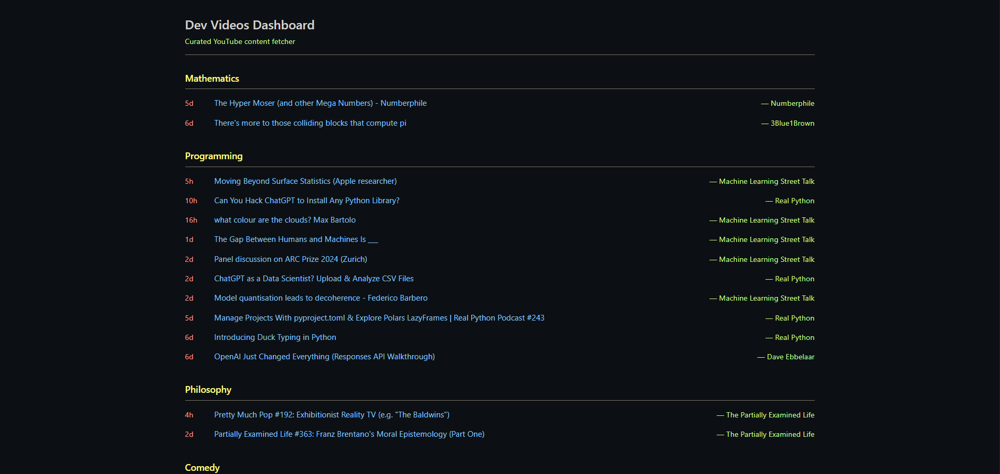

# YouTube Video Dashboard

A web-based dashboard that automatically fetches and categorizes recent YouTube videos from specified channels.



## Features

- Fetches recent videos from categorized YouTube channels
- Configurable date range filter 
- Fallback options for channels with no recent uploads
- FastAPI server for dynamic data fetching and serving

## How It Works

The FastAPI server (`main.py`) handles both API requests and serves the UI:
1. Videos are fetched from YouTube using the YouTube Data API
2. Content is organized by categories and available through API endpoints
3. The same server also serves the static files (HTML, CSS, JS)
4. Access the dashboard by visiting `http://localhost:8000` in your browser

## Setup

### Prerequisites

- Python 3.6+
- YouTube Data API key

### Installation

1. Clone this repository
2. Install dependencies:
   ```
   pip install requests python-dotenv fastapi uvicorn aiofiles
   ```
3. Create a `.env` file with your YouTube API key:
   ```
   APIKEY=your_youtube_api_key_here
   ```

## Usage

Start the FastAPI server:
```
python main.py
```

Then open `http://localhost:8000` in your browser. Use the refresh button in the UI to fetch new videos.

## API Endpoints

The following API endpoints are available:

- `GET /api/videos` - Get all videos organized by category
- `GET /api/refresh` - Refresh videos and save to videos.json
- `GET /videos.json` - Serve the videos.json file (for compatibility)

Query parameters for `/api/videos` and `/api/refresh`:
- `days_back` - Number of days to look back for videos (default: 7)
- `strict_filter` - Whether to use strict date filtering (default: true)
- `fallback_days` - Extended days range for fallback videos (default: null)

## Configuration

Edit the `channels` dictionary in `main.py` to customize your video sources:

```python
channels = {
    "Mathematics": ["3Blue1Brown", "Numberphile", "patrickjmt"],
    "Programming": ["realpython", "ThePrimeTimeagen", "MachineLearningStreetTalk"],
    "Philosophy": ["ThePartiallyExaminedLife"],
    "Comedy": ["DailyDoseOfInternet","standupots"]
}
```

## License

See the [LICENSE](LICENSE) file for details.
